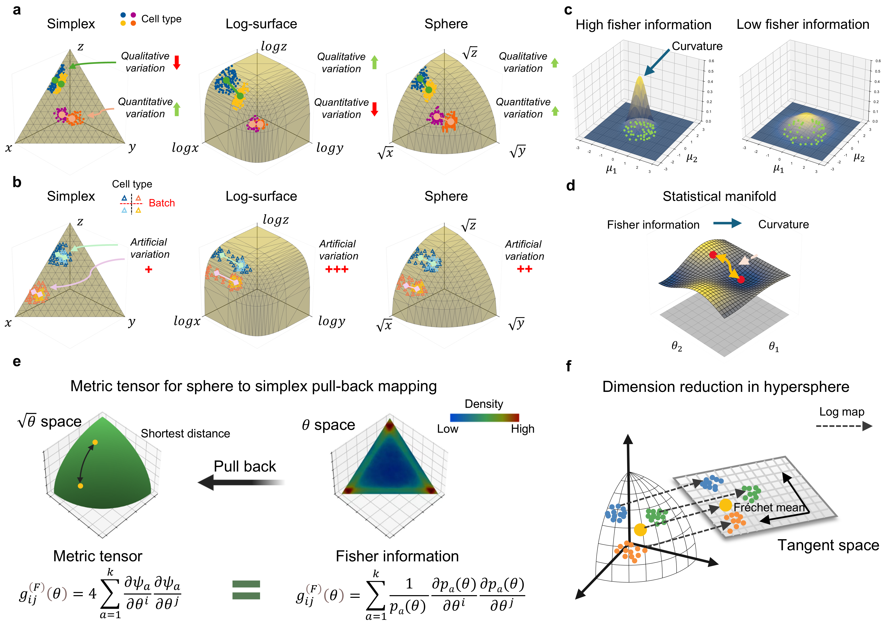

# GAIA: Geometric Analysis for scRNA-seq

GAIA (Geometric Analysis for scRNA-seq) is a tool for geometric analysis of single-cell RNA-seq data.  
It is based on **spherical embedding** and **principal component analysis (PCA)**, allowing researchers to explore the geometric structure and principal components of gene expression data.

  
*Illustration: GAIA workflow from data input to geometric analysis and visualization.*

---

## Environment

It is recommended to create a dedicated Conda environment:

```bash
conda create -n gaia_env python=3.8.11
conda activate gaia_env
conda install -c conda-forge scanpy=1.9.2 pandas=1.3.5 numpy=1.24.3 scikit-learn=1.2.2 geomstats=2.5.0
```

## Install GAIA

```bash
conda install -c steven_cai gaia
```
GAIA installs required dependencies:

- scanpy
- numpy
- pandas
- scikit-learn
- geomstats


## Usage
```bash
import scanpy as sc
import gaia as ga

# Load single-cell data
adata = sc.read_h5ad("your_data.h5ad")

# Run GAIA's Fisher PCA
ga.tl.fisher_PCA(adata)

# Results are stored in adata
# - adata.obsm['X_scfisher']: cell embeddings
# - adata.varm['loading_scFisher']: gene loadings
# Usage is similar to Scanpy's PCA
```

## Tutorial Example
A complete example is provided in `tutorial.ipynb`, which demonstrates:

1. Loading and preprocessing single-cell data
2. Running GAIA's Fisher PCA
3. Visualization and interpretation of results

The tutorial provides step-by-step instructions so you can reproduce the full workflow and explore the geometric properties of your data.

## Citation

If you use GAIA in your research, please cite: xxx


## License

GAIA is released under the MIT License. 


